 

 

---

### 👋 Hi, I'm Arshdeep

I'm a **Training Delivery Specialist at Google Operations Center**, delivering technical programmes to development and QA teams.

Before that I built full-stack products in **Angular** and **Ruby on Rails**, growing from intern to lead developer at [Commudle](https://www.commudle.com/), a developer community platform used by 50,000+ people. The work I'm proudest of: a hackathon platform taken from an empty repo to production, a payments integration that runs real money, and a frontend that got measurably faster.

  

---

### 🧭 Right now

| | |
|---|---|
| 🎓 **Training** | Delivering technical programmes at Google Operations Center |
| 🎤 **Speaking** | *Building Faster with AI*, a hands-on intro to AI-assisted coding at MAIMS, Delhi. Deck at [talks.arshdeepgrover.dev](https://talks.arshdeepgrover.dev/) |
| 🏆 **Hackathons** | Mentoring and judging with GDG chapters, Commudle and college tech societies |
| ✍️ **Writing** | Notes on web development at [blogs.arshdeepgrover.dev](https://blogs.arshdeepgrover.dev/) and [Medium](https://medium.com/@ArshdeepGrover) |
| 💬 **Ask me about** | Angular · Ruby on Rails · AI-assisted coding · Razorpay payments · headless CMS · running a hackathon |

---

### 🛠️ Stack

 

---

### 📊 GitHub, by the numbers

  

<picture>
  <source media="(prefers-color-scheme: dark)" srcset="https://raw.githubusercontent.com/ArshdeepGrover/ArshdeepGrover/output/snake-dark.svg" />
  <source media="(prefers-color-scheme: light)" srcset="https://raw.githubusercontent.com/ArshdeepGrover/ArshdeepGrover/output/snake-light.svg" />
  
</picture>

---

### 📦 Open source

| Project | What it is | Stack | Try it |
|---|---|---|---|
| **[Groupix Spinner](https://github.com/ArshdeepGrover/groupix-spinner-library)** | Lightweight, zero-dependency loader component library | Angular · TypeScript | [npm](https://www.npmjs.com/package/groupix-spinner) · [demo](https://groupix-spinner.vercel.app/) |
| **[content_flagging](https://rubygems.org/gems/content_flagging)** | Content moderation and flagging for Rails apps | Ruby · Rails | [demo](https://content-flagging.netlify.app/) |
| **[Rails Health Monitor](https://github.com/ArshdeepGrover/rails-health-monitor)** | Health checks and a status dashboard for Rails apps | Ruby · Rails | [demo](https://rails-health-monitor.netlify.app/) |
| **[Rails Map](https://rails-map.netlify.app/)** | A visual map of your Rails routes | Ruby · Rails | [demo](https://rails-map.netlify.app/) |

  
  

---

### 🎤 Community

| When | Role | Event |
|---|---|---|
| Oct 2026 | 🎙️ Speaker | Building Faster with AI, MAIMS Delhi |
| Sep 2026 | 🧭 Mentor | NexHack 2.0, NexVerse IITM |
| Jun 2026 | 🧭 Mentor · ★ mentor award | Hack Days Delhi, Commudle Developer Network |
| May 2026 | 🧭 Mentor | Code Nakshatra 2.0, TIIPS Greater Noida · 200+ participants |
| Apr 2026 | ⚖️ Judge | The Dev Arena, GDG × CULMYCA, JC Bose UST |

The full calendar is on <a href="https://www.arshdeepgrover.dev/#community">arshdeepgrover.dev</a>.

---

**Say hi:** [arshdeepgrover.dev@gmail.com](mailto:arshdeepgrover.dev@gmail.com) · [Book a 1:1](https://topmate.io/arshdeepgrover) · [X](https://x.com/ArshdeepGroverS) · [Medium](https://medium.com/@ArshdeepGrover) · [Dev.to](https://dev.to/arshdeepgrover)

P.S. The cat on the banner is <b>Null</b>. On <a href="https://www.arshdeepgrover.dev/">my site</a> it chases your cursor.

  

